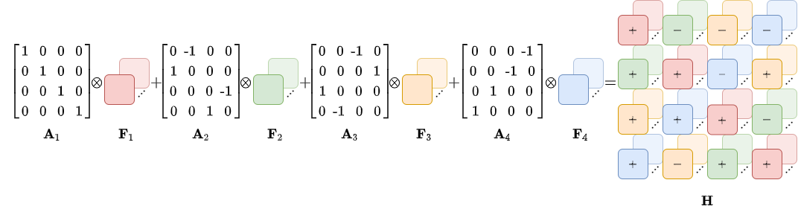

# HyperNets
Hypercomplex Neural Networks with PyTorch: this repository would be a container for hypercomplex neural network modules to facilitate research in this topic. 

### News :bomb:
:warning: PHC layer for 3D convolutions has been released! Check it in the file `layers/ph_layers.py`!

:warning: PHC layer for 1D convolutions has been released! Check it in the file `layers/ph_layers.py`!
Thanks to Christian Brignone and Gioia Mancini for this contribution.

# PHNNs: Lightweight Neural Networks via Parameterized Hypercomplex Convolutions

### [Eleonora Grassucci](https://sites.google.com/view/eleonoragrassucci/home-page?authuser=0), [Aston Zhang](https://www.astonzhang.com/), and [Danilo Comminiello](https://danilocomminiello.site.uniroma1.it/)

[[ArXiv preprint](https://arxiv.org/pdf/2110.04176.pdf)][[IEEEXplore](https://ieeexplore.ieee.org/document/9983846)]


<!-- [](https://paperswithcode.com/sota/on-1?p=lightweight-convolutional-neural-networks-by) -->
[](https://paperswithcode.com/sota/sound-event-detection-on-l3das21?p=lightweight-convolutional-neural-networks-by)

## Abstract :bookmark_tabs:

Hypercomplex neural networks have proved to reduce the overall number of parameters while ensuring valuable performances by leveraging the properties of Clifford algebras. Recently, hypercomplex linear layers have been further improved by involving efficient parameterized Kronecker products. In this paper, we define the parameterization of hypercomplex convolutional layers to develop lightweight and efficient large-scale convolutional models. Our method grasps the convolution rules and the filters organization directly from data without requiring a rigidly predefined domain structure to follow. The proposed approach is flexible to operate in any user-defined or tuned domain, from 1D to nD regardless of whether the algebra rules are preset.
Such a malleability allows processing multidimensional inputs in their natural domain without annexing further dimensions, as done, instead, in quaternion neural networks for 3D inputs like color images.
As a result, the proposed method operates with 1/n free parameters as regards its analog in the real domain. We demonstrate the versatility of this approach to multiple domains of application by performing experiments on various image datasets as well as audio datasets in which our method outperforms real and quaternion-valued counterparts.


## Parameterized Hypercomplex Convolutional (PHC) Layer :dart:

The core of the approach is the sum of Kronecker products which grasps the convolution rule and the filters organization directly from data. The higlights of our approach is defined in:

  ```python
  def kronecker_product1(self, A, F):
    siz1 = torch.Size(torch.tensor(A.shape[-2:]) * torch.tensor(F.shape[-4:-2]))
    siz2 = torch.Size(torch.tensor(F.shape[-2:]))
    res = A.unsqueeze(-1).unsqueeze(-3).unsqueeze(-1).unsqueeze(-1) * F.unsqueeze(-4).unsqueeze(-6)
    siz0 = res.shape[:1]
    out = res.reshape(siz0 + siz1 + siz2)
    return out
   
  def forward(self, input):
    self.weight = torch.sum(self.kronecker_product1(self.A, self.F), dim=0)
    input = input.type(dtype=self.weight.type())      
    return F.conv2d(input, weight=self.weight, stride=self.stride, padding=self.padding)

   ```

Te PHC layer, by setting n=4, is able to subsume the Hamilton rule to organize filters in the convolution as:




## Tutorials :page_with_curl:

The folder `tutorials` contains a set of tutorials to understand the Parameterized Hypercomplex Multiplication (PHM) layer and the Parameterized Hypercomplex Convolutional (PHC) layer. We develop simple toy examples to learn the matrices A that define algebra rules in order to demonstrate the effectiveness of the proposed approach.

* `PHM tutorial.ipynb` is a simple tutorial which shows how the PHM layer learns the Hamilton product between two pure quaternions.
* `PHC tutorial.ipynb` is a simple tutorial which shows how the PHC layer learn the Hamilton rule to organize filters in convolution.
* `Toy regression examples with PHM.ipynb` is a notebook containing some regression tasks.

## Experiments on Image Classification :city_sunset:

To reproduce image classification experiments, please refer to the `image-classification` folder.

* ```pip install -r requirements.txt```.
* Choose the configurations in `configs` and run the experiment:

```python main.py --TextArgs=config_name.txt```.

The experiment will be directly tracked on [Weight&Biases](https://wandb.ai/).

## Experiments on Sound Event Detection :musical_score:

To reproduce sound event detection experiments, please refer to the `sound-event-detection` folder.

* ```pip install -r requirements.txt```.

We follow the instructions in the original repository for the [L3DAS21](https://github.com/l3das/L3DAS21) dataset:

* Download the dataset:

```python download_dataset.py --task Task2 --set_type train --output_path DATASETS/Task2```

```python download_dataset.py --task Task2 --set_type dev --output_path DATASETS/Task2```

* Preprocess the dataset:

```python preprocessing.py --task 2 --input_path DATASETS/Task2 --num_mics 1 --frame_len 100```

Specify `num_mics=2` and `output_phase=True` to perform experiments up to 16-channel inputs.

* Run the experiment:

```python train_baseline_task2.py```

Specify the hyperparameters options.
We perform experiments with `epochs=1000`, `batch_size=16` and `input_channels=4/8/16` on a single Tesla V100-32GB GPU. 

* Run the evaluation:

```python evaluate_baseline_task2.py```

Specify the hyperparameters options.

## More will be added :date:

:warning: Work in progress...

* PHC for transposed convolutions
* PHC in TensorFlow

## Cite

Please cite our work if you found it useful:

```
@article{grassucci2021PHNNs,
      title={{PHNN}s: Lightweight Neural Networks via Parameterized Hypercomplex Convolutions}, 
      author={Grassucci, E. and Zhang, A. and Comminiello, D.},
      year={2022},
      journal={IEEE Transactions on Neural Networks and Learning Systems}, 
      year={2022},
      pages={1-13},
      doi={10.1109/TNNLS.2022.3226772}}
```

## Similar reporitories :busts_in_silhouette:

* [Quaternion Generative Adversarial Networks](https://github.com/eleGAN23/QGAN).
* [A Quaternion-Valued Variational Autoencoder](https://github.com/eleGAN23/QVAE).
* [PHC-GNN](https://github.com/bayer-science-for-a-better-life/phc-gnn).
* [Compacter](https://github.com/rabeehk/compacter/).

Quaternion layers are borrowed from:

* [Quaternion-Neural-Networks](https://github.com/TParcollet/Quaternion-Neural-Networks).

